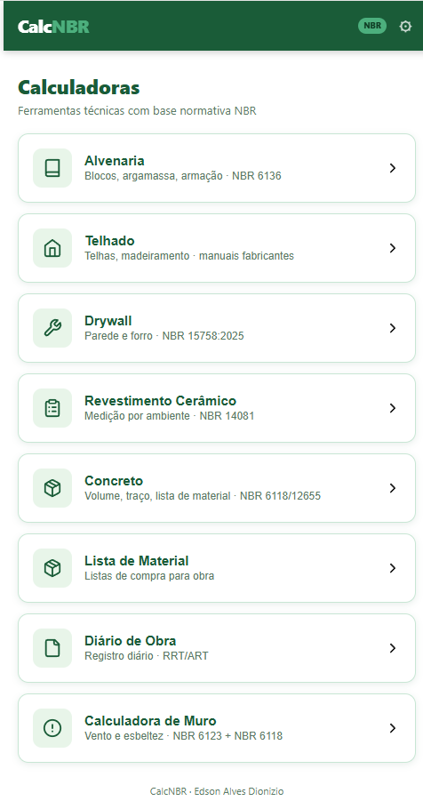

[README.md](https://github.com/user-attachments/files/30873822/README.md)

# CalcNBR

Calculadoras técnicas offline para profissionais da construção civil brasileira, baseadas nas normas ABNT NBR.

## Links do Projeto

- **Versão Android:** Em breve na Google Play Store (Gerado via PWABuilder)
- **DOI:** https://doi.org/10.5281/zenodo.21861398

Aplicativo Progressive Web App (PWA) com calculadoras técnicas para alvenaria, drywall, revestimento cerâmico, telhado, concreto, muro, lista de material e diário de obra. Funciona 100% offline — todos os dados são armazenados localmente no dispositivo do usuário, sem necessidade de servidor ou conexão à internet.

Projeto pessoal de Edson Alves Dionizio — pesquisa e desenvolvimento em tecnologia aplicada à construção civil. Distribuído gratuitamente.

## Módulos disponíveis

- **Alvenaria** — Blocos, argamassa e armação (NBR 6136 / NBR 8681)
- **Telhado** — Telhas e madeiramento
- **Drywall** — Parede e forro (NBR 15758:2025)
- **Revestimento Cerâmico** — Medição por ambiente (NBR 14081)
- **Concreto** — Volume, traço e lista de material (NBR 6118 / NBR 12655)
- **Lista de Material** — Listas de compra por obra
- **Diário de Obra** — Registro diário com RRT/ART
- **Calculadora de Muro** — Vento e esbeltez (NBR 6123 / NBR 6118)

## Características

- 100% offline — funciona sem internet
- Dados salvos localmente no dispositivo
- Não coleta dados pessoais
- Geração de relatórios em PDF
- Interface adaptada para uso em campo

## Política de Privacidade

https://edsondionizio77-dot.github.io/calcnbr/privacy.html

## Contato

edsondionizio77@gmail.com

## Versão

1.0.1

---

© 2026 NBR Apps. Todos os direitos reservados.
